# Implicit Surfaces
**By Janine Liu / jliu99**

# External Resources

In addition to the class lectures and powerpoints, I consulted a few external resources for this project:
- http://jamie-wong.com/2016/07/15/ray-marching-signed-distance-functions/#signed-distance-functions, for a summary of the ray-marching algorithm.
- http://www.iquilezles.org/www/articles/distfunctions/distfunctions.htm, for a list of signed distance functions.

# Live GitHub demo
https://j9liu.github.io/hw2/

# Features

The background is a simple gradient between a pale yellow and green palette, linearly mixed with position of the fragments.

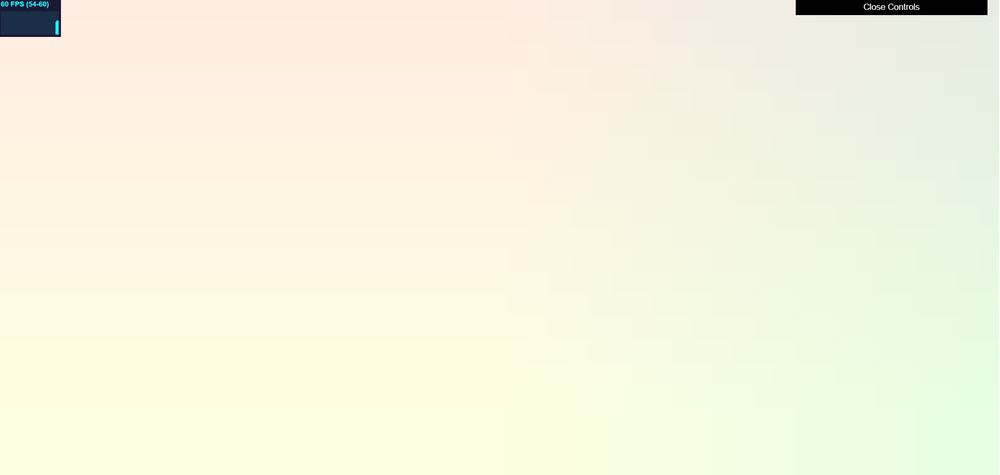

The bowl was modeled using a capped cone SDF, where the depression in the bowl results from subtracting a smaller version of the volume. For shading, the 

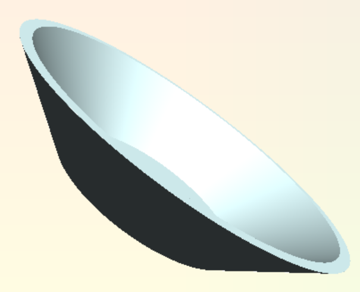

The ice scream scoops were modeled using variously transformed sphere SDFs. The base is a union of twelve spheres rotated around the scoop's local origin.

A large sphere is then inserted at the origin and unioned with this ring. 

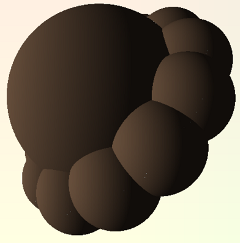

Finally, to appear more cohesive, the basic unions are replaced by smoothly blended unions to make the scoop look more cohesive.

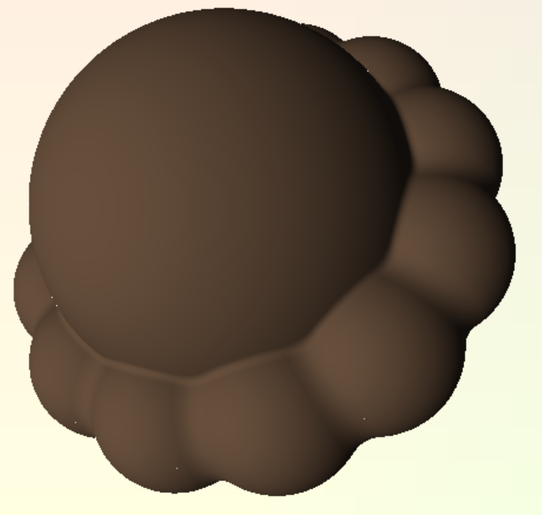

This scoop model serves as a base for all the scoops in the scene, which then manipulate it with their own transformations. For texturing, all ice cream scoops are affected by a Lambertian shader that is modified to give colored shadows, to combat the monotone quality of the default black shadows, as well as a perturbed FBM function to give it the illusion of ridges along its surface, similar to actual ice cream.

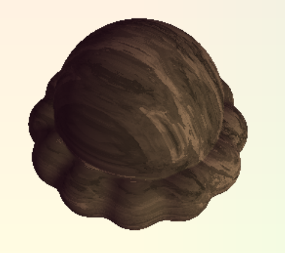

For the chocolate-vanilla marble ice cream, the perturbed FBM was used to produce a pattern that was added on to the base color. However, the additive lighting meant that the bae would always appear as vanilla, instead of chocolate. 

To get the desired color scheme, I used a dark gray as my base color, added the pattern, and inverted the colors so that the base was black and the marble was white. From there, I could add any color to the black and get my desired base.

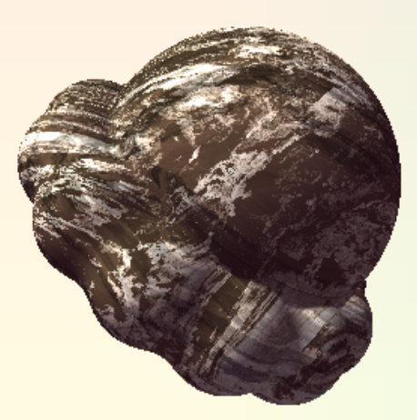

For the mint chocolate chip ice cream, I applied the same perturbed FBM to generate striations through the scoop. I then used worley noise to calibrate the points and cells generated with worley noise, passing the points through a random function. The cells whose values fall above an arbitrary threshold are attributed a brown color to represent chocolate chips.

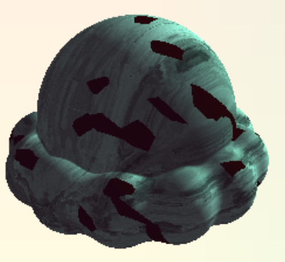

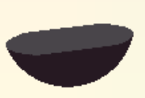
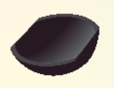
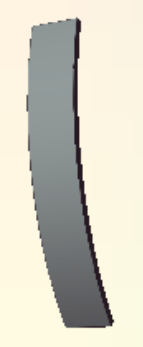
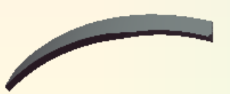
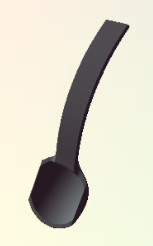