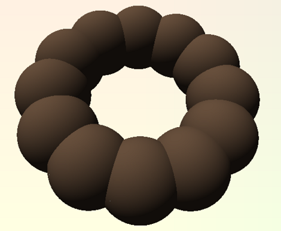
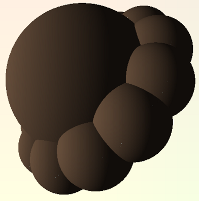
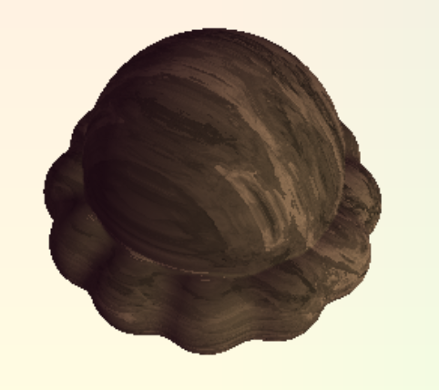
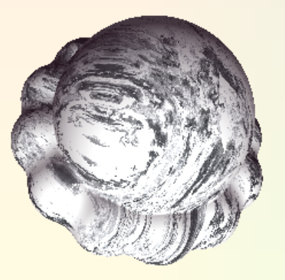
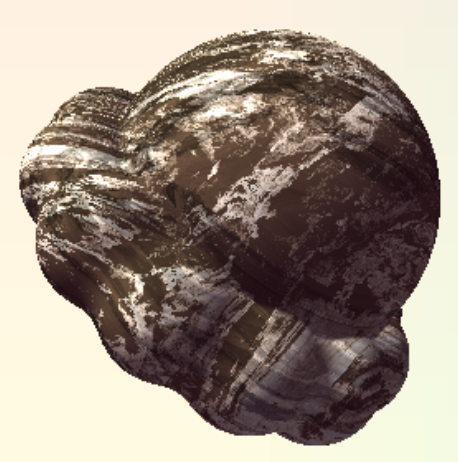
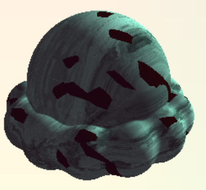
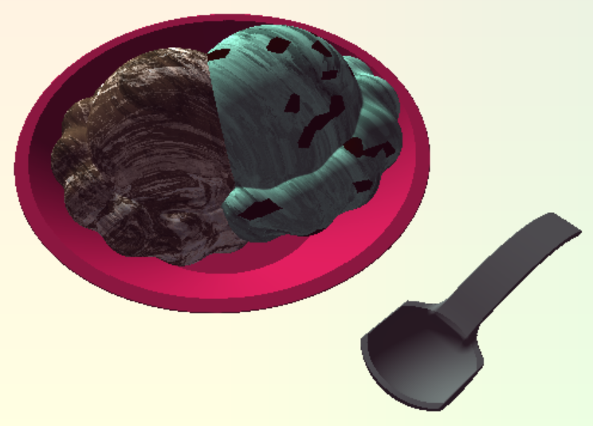

# Implicit Surfaces
**By Janine Liu / jliu99**

# External Resources

In addition to the class lectures and powerpoints, I consulted a few external resources for this project:
- http://jamie-wong.com/2016/07/15/ray-marching-signed-distance-functions/#signed-distance-functions, for a summary of the ray-marching algorithm.
- http://www.iquilezles.org/www/articles/distfunctions/distfunctions.htm, for a list of signed distance functions.
- https://www.scratchapixel.com/lessons/3d-basic-rendering/minimal-ray-tracer-rendering-simple-shapes/ray-box-intersection?fbclid=IwAR2amk8y64GOzu_g23Aoay7oNOFnJpEiQ-xlkH53MykDw9HbkO2DHeSeIec, for how to intersect a cube (for the bounding volume boxes).

# Live GitHub demo
https://j9liu.github.io/hw2/

# Features

The background is a simple gradient between a pale yellow and green palette, linearly mixed with position of the fragments.

The bowl was modeled using a capped cone SDF, where the depression in the bowl results from subtracting a smaller version of the volume. I used a Blinn-Phong shader to add lighting based on the approximated normals of the shape.

Of the toolbox functions, I used "gain" to animate cartoon shines passing over the bowl. They are stripes of light that are randomly positioned using FBM, and the time is modulo'd to repeat after a certain interval.

The ice scream scoops were modeled using variously transformed sphere SDFs. The base is a union of twelve spheres rotated around the scoop's local origin.

A large sphere is then inserted at the origin and unioned with this ring. 

Finally, to appear more cohesive, the basic unions are replaced by smoothly blended unions to make the scoop look more cohesive.

This scoop model serves as a base for all the scoops in the scene, which then manipulate it with their own transformations. For texturing, all ice cream scoops are affected by a Lambertian shader that is modified to give colored shadows, to combat the monotone quality of the default black shadows, as well as a perturbed FBM function to give it the illusion of ridges along its surface, similar to actual ice cream.

For the chocolate-vanilla marble ice cream, the perturbed FBM was used to produce a pattern that was added on to the base color. However, the additive lighting meant that the bae would always appear as vanilla, instead of chocolate. 

To get the desired color scheme, I used a dark gray as my base color, added the pattern, and inverted the colors so that the base was black and the marble was white. From there, I could add any color to the black and get my desired base.

For the mint chocolate chip ice cream, I applied the same perturbed FBM to generate striations through the scoop. I then used worley noise to calibrate the points and cells generated with worley noise, passing the points through a random function. The cells whose values fall above an arbitrary threshold are attributed a brown color to represent chocolate chips.

The spoon's structure was slightly more complicated: I first created the head of it by intersecting a sphere with a box, which gave a stylized spoon shape.

 

Similar to the bowl, I created the dip in the middle by subtracting a smaller version of the volume from the original.

For the handle, I created a thin box that I manipulated IQ's "cheap bend" operation to have a curve.

 

Finally, I combined the pieces together and to get a nice metal spoon, which wiggles in place based on a cosine wave function.

After transforming each object into the desired positions, the finished product is as shown:

# Known Bugs

Although the colors of the ice cream can be changed with the datGUI interface, clicking anywhere on the scene after adjusting this color will cause the color to go black, unable to be modified again. I have been told this is more of a problem with datGUI, and thus have no knowledge of how to fix it.